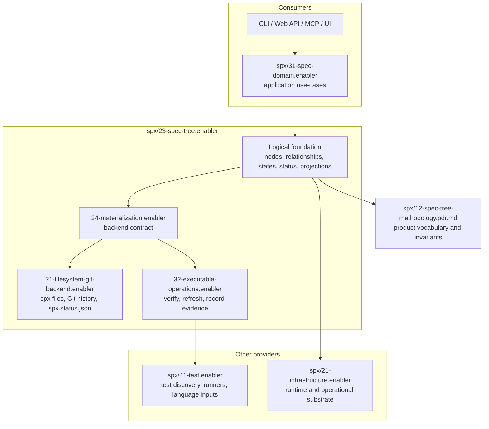

# Plan: Spec-tree foundation ownership repair

This coordination note preserves the top-down repair model before the tree is restructured. It is not product truth. The follow-up work is to author or move the durable PDRs, ADRs, specs, tests, and implementation after the ownership boundaries are settled.

## Target ownership model

| Layer                       | Owner                                                                                    | Responsibility                                                                                                                                                                                          |
| --------------------------- | ---------------------------------------------------------------------------------------- | ------------------------------------------------------------------------------------------------------------------------------------------------------------------------------------------------------- |
| Methodology vocabulary      | `spx/12-spec-tree-methodology.pdr.md`                                                    | Defines the product-wide vocabulary every later node uses: durable map, node, dependency order, decision reach, assertion, evidence, status, state, materialization, provider, consumer, and interface. |
| Logical foundation          | `spx/23-spec-tree.enabler/`                                                              | Owns spec-tree business logic: node identity, relationships, dependency graph semantics, state model, status semantics, projection semantics, and logical operations.                                   |
| Materialization             | `spx/23-spec-tree.enabler/24-materialization.enabler/`                                   | Owns the backend contract that materializes the logical foundation: current state, history, per-node metadata, dependency queries, evidence records, and executable operations.                         |
| Filesystem backend          | `spx/23-spec-tree.enabler/24-materialization.enabler/21-filesystem-git-backend.enabler/` | Implements the first backend with tracked `spx/` files, Git history, local `.spx/` evidence, and `spx.status.json` as filesystem per-node metadata.                                                     |
| Executable operation bridge | `spx/23-spec-tree.enabler/24-materialization.enabler/32-executable-operations.enabler/`  | Defines how a backend requests, records, or delegates operations such as node verification and evidence refresh.                                                                                        |
| Testing provider            | `spx/41-test.enabler/`                                                                   | Owns runner adapters, test discovery, language descriptor dispatch, and language-owned product-input discovery.                                                                                         |
| Spec-domain consumer        | `spx/31-spec-domain.enabler/`                                                            | Consumes the logical spec-tree foundation and feeds interfaces such as CLI, web API, MCP, and UI. It renders and adapts; it does not own spec-tree state semantics.                                     |

## Main diagnosis

The product has the right broad areas, but the responsibilities are mixed across layers:

- `spx/31-spec-domain.enabler/21-node-status.enabler/` contains state, status, stale, and filesystem metadata behavior that belongs under the spec-tree logical foundation and materialization backend.
- `spx/23-spec-tree.enabler/` is too small for the role the product expects from it. It provides source, assembly, traversal, state derivation, and projection, but it does not yet own the full state/status/materialization model.
- `spx/41-test.enabler/` owns runner mechanics and recorded test freshness, but status staleness currently reaches into language-specific TypeScript import discovery from the wrong layer.
- `spx/12-node-runtime.adr.md` is a top-level architecture record whose reach is broader than most consumers need. The runtime mechanics belong under infrastructure, while product-wide methodology vocabulary belongs in a top-level PDR.

## Desired top-level structure

```text
spx/
├── 12-spec-tree-methodology.pdr.md
├── 21-infrastructure.enabler/
├── 23-spec-tree.enabler/
│   ├── 24-materialization.enabler/
│   │   ├── 21-filesystem-git-backend.enabler/
│   │   └── 32-executable-operations.enabler/
│   ├── 29-filename-grammar.enabler/
│   ├── 32-spec-tree-source.enabler/
│   ├── 54-spec-tree-assembly.enabler/
│   ├── 65-spec-tree-traversal.enabler/
│   ├── 76-node-state-derivation.enabler/
│   └── 87-spec-tree-projection.enabler/
├── 31-spec-domain.enabler/
├── 41-test.enabler/
└── later consumers and product domains
```

The indices above are working notes. `/decompose` must settle final index assignment from ordering evidence before specs are authored.

## Dependency model



## Methodology PDR intent

Author `spx/12-spec-tree-methodology.pdr.md` as the product-wide vocabulary record. It carries product behavior, not implementation mechanics.

The PDR should define:

- **Durable map.** The spec tree is the durable map of product truth.
- **Truth hierarchy.** Decisions govern specs; specs declare; tests verify; code complies.
- **Node vocabulary.** Enabler, outcome, child, sibling, dependency, provider, consumer, and internal node have product meanings.
- **Ordering vocabulary.** Numeric order expresses dependency order and context reach.
- **Decision reach.** A lower-index decision or provider contract reaches later siblings through its public contract; internal provider decisions stay inside the provider unless a consumer needs them.
- **Assertion and evidence vocabulary.** Assertions declare observable behavior; evidence verifies assertions through deterministic tests, evals, or audits.
- **State vocabulary.** Node state is derived from evidence and materialization, never assigned by a person. The state model must admit future states such as `prototype`, where implementation exists before test evidence and deployment or feature flags decide visibility.
- **Materialization vocabulary.** A backend materializes current state, history, per-node metadata, dependency inputs, evidence records, and executable operations.
- **Consumer vocabulary.** Interfaces consume the logical foundation through product use-cases and do not own storage or state semantics.

Keep filesystem, Git, `spx.status.json`, CLI flags, and language runners out of the PDR except as examples in follow-up notes. Those belong in lower nodes.

## Spec-tree foundation intent

`spx/23-spec-tree.enabler/` should become the logical foundation for the methodology. It owns:

- node identity and relationship semantics
- dependency graph semantics
- state derivation and state vocabulary
- status semantics, including stale/fresh projection
- projection contracts for consumers
- logical operations such as read tree, derive state, compute dependency inputs, refresh evidence, and select next work

Its public surface can still be TypeScript today. The product boundary is logical, so a later backend or interface is not forced to use the filesystem layout or CLI.

## Materialization intent

Create a materialization child under `spx/23-spec-tree.enabler/` to define the backend contract. The materialization layer must support:

- static read operations over nodes, decisions, assertions, and evidence links
- history queries over materialized product paths and node metadata
- per-node metadata storage and retrieval
- dependency path or dependency token resolution
- executable operation requests and results
- backend-specific evidence records

Filesystem + Git is one backend. SQLite, graph DB, GraphQL API, Linear, GitHub Issues, or GitHub-backed storage are future backends if they can provide the same classes of current state and history.

## Filesystem backend intent

The filesystem backend owns:

- tracked `spx/` files as materialized current state
- Git history as the history source
- `.spx/worktree/` evidence as local execution evidence
- `spx.status.json` as filesystem per-node metadata
- status-file schema and stale-file sweep behavior

`spx.status.json` stores backend metadata. The logical state semantics belong above it.

## Executable operations intent

Executable operations are part of the materialization contract, but runner mechanics stay with the testing provider.

The materialization contract should say:

- a backend can request node verification
- a backend can report executable evidence
- a backend can declare whether evidence is local, remote, cached, or unavailable
- a backend can surface unsupported operations deterministically

The testing domain should say:

- how tests are discovered
- how language descriptors expand product inputs
- how runner adapters execute tests
- how last-run evidence is recorded and compared

## Spec-domain consumer intent

`spx/31-spec-domain.enabler/` should become a consumer. It should own:

- application-level status and next-work use-cases as calls into the foundation
- CLI and API request parsing
- terminal/API/MCP/UI rendering contracts
- diagnostics and exit behavior

It should not own:

- node state vocabulary
- status semantics
- stale dependency semantics
- filesystem backend metadata schema
- language dependency discovery
- executable evidence semantics

## Node-status changeset disposition

The node-status staleness implementation should pause before merge in its present ownership shape. Its implementation is useful as an evidence inventory for what the filesystem backend and TypeScript test-input path need, but the current ownership is wrong.

Keep from the branch as inputs:

- `spx/EXCLUDE` participates in status freshness.
- Runtime import extensions matter for TypeScript product-input discovery.
- Local `require`, dynamic `import`, `import type`, and import-equals forms matter for TypeScript descriptor input expansion.
- Root-level relative TypeScript imports matter.
- Status stale projection should never change lifecycle state.

Do not preserve from the branch as architecture:

- TypeScript AST import walking inside `src/lib/node-status/`
- status dependency graph semantics owned by spec-domain
- `spx.status.json` treated as product-wide status truth rather than filesystem backend metadata
- CLI command path as orchestration owner

## Repair sequence

1. Use `/decompose spx/` to settle top-level placement for `spx/12-spec-tree-methodology.pdr.md` and the runtime ADR relocation.
2. Use `/author` to write `spx/12-spec-tree-methodology.pdr.md`.
3. Use `/decompose spx/23-spec-tree.enabler` to settle materialization, filesystem backend, executable operations, and state/status/projection boundaries.
4. Use `/author` to create or amend specs and ADRs under `spx/23-spec-tree.enabler`.
5. Amend `spx/31-spec-domain.enabler` and `spx/31-spec-domain.enabler/21-node-status.enabler` so they record evacuation of state/status/storage semantics to the provider.
6. Amend `spx/41-test.enabler` so language descriptors own product-input expansion for testing freshness and status dependency inputs.
7. Apply the implementation migration:
   - move logical state/status behavior from spec-domain into spec-tree
   - model filesystem/Git/status-file behavior as the current materialization backend
   - move TypeScript import expansion into the TypeScript testing descriptor path
   - keep spec-domain as consumer and renderer
8. Run the full gated workflow for the repaired slice: spec/ADR/PDR audits, test-evidence audits, TypeScript audits, focused `spx test`, `pnpm run validate`, changes review, commit, and `/merge`.

## Affected node notes

Detailed coordination notes now live in:

- `spx/23-spec-tree.enabler/PLAN.md`
- `spx/23-spec-tree.enabler/24-materialization.enabler/PLAN.md`
- `spx/23-spec-tree.enabler/24-materialization.enabler/21-filesystem-git-backend.enabler/PLAN.md`
- `spx/23-spec-tree.enabler/24-materialization.enabler/32-executable-operations.enabler/PLAN.md`
- `spx/23-spec-tree.enabler/32-spec-tree-source.enabler/PLAN.md`
- `spx/23-spec-tree.enabler/76-node-state-derivation.enabler/PLAN.md`
- `spx/23-spec-tree.enabler/87-spec-tree-projection.enabler/PLAN.md`
- `spx/31-spec-domain.enabler/PLAN.md`
- `spx/31-spec-domain.enabler/21-node-status.enabler/PLAN.md`
- `spx/41-test.enabler/PLAN.md`
- `spx/21-infrastructure.enabler/PLAN.md`

## Open structural questions for `/decompose`

| Question                                                                                                                                                                   | Candidate answer to test                                                                                                  |
| -------------------------------------------------------------------------------------------------------------------------------------------------------------------------- | ------------------------------------------------------------------------------------------------------------------------- |
| Does `spx/23-spec-tree.enabler/24-materialization.enabler` need to sit below all logical children, or should logical children consume it through a same-index public port? | Put materialization lower than source/state/projection because later logical operations need its contract as context.     |
| Is `spx/23-spec-tree.enabler/32-spec-tree-source.enabler` part of materialization or a logical source-record adapter layer?                                                | Treat it as a logical source-entry adapter until `/decompose` decides whether filesystem source moves under the backend.  |
| Does `spx.status.json` move entirely under filesystem backend, or does a generic node-metadata schema sit above backend-specific files?                                    | Generic node metadata belongs in materialization; JSON file shape belongs in filesystem backend.                          |
| Where does `prototype` live?                                                                                                                                               | In the top-level methodology vocabulary and spec-tree state model; backend and interfaces then materialize and render it. |
| Where does runtime ADR reach belong?                                                                                                                                       | Runtime mechanics under infrastructure; product-wide methodology vocabulary at top-level PDR.                             |

## Completion criteria for this coordination plan

- `spx/12-spec-tree-methodology.pdr.md` exists and is audited.
- `spx/23-spec-tree.enabler` owns logical state/status/materialization vocabulary.
- `spx/31-spec-domain.enabler` owns only consumer/interface behavior.
- `spx.status.json` is documented as filesystem backend metadata.
- Language-specific dependency expansion is owned by testing language descriptors.
- The stale node-status branch is either rewritten on top of the new structure or replaced by a smaller repaired slice.

---

## Existing plan: Current spec tree refactor

## Purpose

Keep the product spec tree on the current node model and remove the deprecated task-driven model from specs, source, tests, fixtures, validation policy, and coordination files.

## Completed

- Current `spx spec status` and `spx spec next` read the `spx/` tree through the public spec-tree surface.
- Current spec-tree source, entry recognition, assembly, traversal, state derivation, and projection evidence lives under `spx/23-spec-tree.enabler/`.
- Current spec-domain command, rendering, and CLI contract evidence lives under `spx/31-spec-domain.enabler/`.
- Current spec-tree fixtures use `withSpecTreeEnv` under `testing/harnesses/spec-tree/`.
- Deprecated root spec subtrees and deleted compatibility source paths are not product truth.
- Deprecated task-model directories, stale suffix excludes, and frozen legacy specs are removed from the product tree.
- Deprecated `testing/fixtures/repos/` task-model fixtures are removed; current fixture coverage lives under registered spec-tree and validation harnesses.
- Deprecated suffix debt manifest cleanup is complete; remaining deprecated suffix handling is enforcement-only.
- Stale migration notes are removed from the current spec-tree refactor plan; any remaining release-note work lives in the owning validation issue.

## Current Tranche

- Settled config packet foundations on `origin/main`: shared path-filter primitives, testing descriptor registration, canonical descriptor digest, and product-directory API vocabulary.
- The agentic verification domains (audit, review) collapsed into the type-agnostic run-journal channel at `spx/34-verification.enabler/21-journal.enabler/` and were removed; spx journals these runs through `spx journal` rather than orchestrating auditors or reviewers or persisting per-domain audit/review state.
- Settled agent-environment foundations on `origin/main`: agent-environment descriptor and runtime-config reconciliation.
- Active testing packets: extend spec-tree fixture coverage through `spx/22-test-environment.enabler/32-spec-tree-fixtures.enabler/` and persist cached status evidence through `spx/41-test.enabler/43-last-run-evidence.enabler/`.
- Active file-inclusion packet: align reusable path-scope mechanics through `spx/17-file-inclusion.enabler/65-domain-path-filters.enabler/`; final ignore-source deletion follows testing passing-scope integration.
- Active agent-environment packets: add deterministic instruction-file management through `spx/33-agent-environment.enabler/21-agent-instructions.enabler/` and plugin bootstrap through `spx/33-agent-environment.enabler/43-plugin-bootstrap.enabler/`.

## Remaining Work

- Implement the git-tracking layer per the rewritten `spx/17-file-inclusion.enabler/11-ignore-defaults.pdr.md`: the existing `21-ignore-source.enabler/` becomes a git-plumbing reader, the `spx/EXCLUDE`-reader code is deleted, and the consumer adapters in validation and testing wire the override flags (`--no-ignore`, `--no-ignore-vcs`, `--ignore-file`) per the rewritten PDR.
- Continue splitting `src/lib/spec-tree/index.ts` internally only after the public import surface stays stable.
- Keep command modules consuming the public spec-tree surface; command modules must not parse suffixes or assemble hierarchy themselves.
- Continue reducing test-owned constant debt until `eslint.test-owned-constant-debt-nodes.json` is empty.
- Keep reducing root-directory API and test vocabulary from `projectRoot` / `projectDir` to `productDir` in coherent owning tranches where product-root boundaries are edited.
- Reconcile or prune `spx/46-claude.outcome/` after agent instructions and plugin bootstrap settle under `spx/33-agent-environment.enabler/`.

## Acceptance

- No product spec-tree directory uses a deprecated node suffix.
- No source, test, fixture, or coordination file imports from deleted compatibility source paths.
- No validation rule, test helper, or public identifier uses deprecated task-model names.
- Deprecated node suffixes are rejected by lint policy without a debt manifest.
- Testing passing-scope policy is read from the testing config descriptor.
- Validation and testing consume shared config primitives where their descriptor shapes repeat.
- Agent environment management has a current spec-tree node before implementation begins.
- `spx validation all` passes.
- The full package test gate passes.

---

## Infrastructure Governance

spx groups global product machinery under `spx/21-infrastructure.enabler/`. Test infrastructure implementation modules can live together under the product-root `testing/` package, path-mapped to `@testing/`, while their specifications stay with the product domain that owns the behavior they verify. Only global machinery and cross-domain harnesses, generators, and fixtures belong under the infrastructure node.

### Placement model

- `spx/21-infrastructure.enabler/` governs global operational substrate: hooks, shared workflow machinery, cross-domain worktree layout harnesses, and similar product-wide enablers.
- Domain-owned harness, generator, and fixture specs stay with the domain they verify, even when the implementation modules live under `testing/`.
- Code package layout never determines spec placement by itself; spec placement follows product concern ownership, dependency order, and verification scope.

### Current governance (reconcile, do not duplicate)

- `spx/22-test-environment.enabler/` governs the callback-scoped temp-dir primitive (`withTempDir`), the spec-tree env (`withTestEnv`/`withSpecTreeEnv`), the git-worktree harness, and spec-tree fixtures, under `21-callback-scoped-environment.adr.md`.
- `spx/41-validation.enabler/32-typescript-validation.enabler/32-literal-reuse.enabler/45-ts-snippet-generators.enabler/` governs the snippet generators.
- `spx/21-infrastructure.enabler/43-precommit.enabler/` governs Lefthook precommit behavior and precommit-specific test harnessing.
- A per-module `21-test-harness.enabler` governs each promoted harness beside its owning domain node: the file-inclusion harnesses under `spx/17-file-inclusion.enabler/{21-ignore-source,32-path-predicates,43-scope-resolver,54-tool-adapters}.enabler/`, the literal-reuse harnesses under `spx/41-validation.enabler/32-typescript-validation.enabler/32-literal-reuse.enabler/{21-detection,21-fixture-classification,32-value-allowlist.enabler/21-allowlist-existing}.enabler/`, and the session-store harness under `spx/36-session.enabler/43-session-store.enabler/`.
- Ungoverned today: the testing recording-runner (`testing/harnesses/testing/`), the config, agent-environment, agent-run-journal, process-lifecycle, worktree, state, spec-tree, github-snapshot, and hook harnesses and generators (the session launcher/picker harnesses are governed under `spx/36-session.enabler/87-session-pick.enabler/`, the validation harnesses are governed under `spx/41-validation.enabler/32-typescript-validation.enabler/32-ast-enforcement.enabler/43-eslint-test-harness.enabler/` or fully covered by their owning domain tests, and the node-status harnesses are governed under `spx/31-spec-domain.enabler/21-node-status.enabler/32-node-status-test-support.enabler/`).

### Remaining harness governance program

Bring every remaining ungoverned `testing/harnesses/**` and `testing/generators/**` module under a governing spec, batch by batch, one PR per batch. This is queued as SPX sessions; each session governs one batch.

**Approach (uniform across batches).** For each harness/generator module, author a per-module `NN-test-harness.enabler` (or `NN-…-generators.enabler`) beside its owning domain node — the same pattern already applied to file-inclusion, literal-reuse, session-store, and session-pick. Follow the `spx/17-file-inclusion.enabler/21-ignore-source.enabler/21-test-harness.enabler` exemplar: a `PROVIDES … SO THAT … CAN …` opening naming the fixture/builder surface, one `[test]` assertion exercising the harness's own behavior (property or scenario), and `[audit]` compliance for the disciplines no deterministic test verifies (no real process/terminal/network, fixtures drawn from generators, write through the spec-tree test env). Index each as a low-index provider child (`21-…`); when two harnesses serve one domain node they are same-index independent peers. Where two modules under one parent collide on the bare slug, give each a descriptive slug (`launch-runner-test-harness`, `picker-test-harness`).

**Builders, not drivers (refined while governing the validation batch's `eslint.ts`).** Govern only the reusable-builder surfaces — factories, recording objects, case-run constructors, env harnesses, generator factories. A **scenario-driver** harness — one whose single export runs a domain node's own scenarios and embeds their assertions (`runMarkdownValidationScenario`, `runValidationLintPolicyScenario`, `runValidationPipelineScenario`) — gets **no** governance node: its behaviour is the domain node's behaviour, already governed there, so a governance `[test]` would be vacuous (zero net-new coverage, which the coverage gate rejects). A module may split by evidence level — govern the l1 builder surface in the node and leave an l2 helper surface to its existing consumer. And a **fully consumer-covered** generator gets no node at all: when its every live builder is already exercised (cross-cutting config by a harness node, case factories by the owning domain's rule tests), the coverage gate has nothing net-new to govern — author no node, and remove any dead export the survey turns up (the validation batch's `testing/generators/validation/ast-enforcement.ts` was that case). Before authoring a node, confirm the module's actual consumers and owning sub-enabler from the import sites (the validation batch found `eslint.ts` consumed by `32-ast-enforcement`, not `32-lint`).

**Per batch, route through:** `/understand` → `/contextualize <owning-node>` → read the owning node's `PLAN.md` → `/author` the governance node(s) for the builder surfaces → `/apply` audit gates → `/merge`.

**Audit gates (blocking, per node).** Dispatch `spec-auditor` and `test-evidence-auditor` (the TypeScript test audit is composed by `test-evidence-auditor`; there is no `typescript-test-auditor` agent). The `test-evidence-auditor` enforces a **coverage gate**: each governance `[test]` must add net-new statement coverage of the harness — i.e. cover harness statements the consuming domain tests do not exercise (often an unused method, e.g. a recording child's `kill()` or a picker's arrow drivers). Zero net-new coverage with the harness not at 100% is a REJECT; extend the `[test]` (and its assertion) to drive those statements. The `changes-reviewer` also flags any PROVIDES-named capability with no covering assertion — either assert it or drop it from PROVIDES.

**Literal-collision lessons (the `testing/` package is "src" to the literal checker).** Test inputs come from generators, never hardcoded. Avoid reusing a `src`/`testing` string literal in a governance test: event-name literals (`"exit"`, `"error"`), the TOML `= "` separator, common tokens (`"utf-8"`, `"string"`, `"src"`). Read fixture files as a `Buffer` (no encoding arg) and use `Buffer.includes`, or import the source constant, or derive structural segments from a generator (`dirname` of a sampled path). One assertion type per test file (`.scenario`/`.property`/`.mapping`/…). `sampleX(generator)` is deterministic only when the generator is `fc.constant`-based; otherwise the value differs per call — don't predict a random generated path, snapshot or walk instead.

**Batches (owning node ← modules):**

1. **Validation** — **done**: `43-eslint-test-harness.enabler` was the sole node; every other module is fully consumer-covered or a driver, and two dead exports were removed. ← `spx/41-validation.enabler` (and sub-enablers `21-validation-cli`, `65-markdown-validation`, `32-typescript-validation/{32-lint,32-ast-enforcement,32-circular-deps}`): `testing/harnesses/validation/{cli,eslint,lint-policy,markdown,pipeline,subprocess}.ts`, `with-validation-env.ts`; `testing/generators/validation/{ast-enforcement,lint-policy,markdown,validation}.ts`.
2. **Testing recording-runner** ← `spx/41-test.enabler` (sub `21-python-test`, `21-typescript-test`, `85-agent-test-output`): `testing/harnesses/testing/{cli,harness,python-runner,typescript-runner,python-product-inputs}.ts`; `testing/generators/testing/{dispatch,python-runner,run-state,typescript-runner}.ts`.
3. **Node-status** — **done**: `spx/31-spec-domain.enabler/21-node-status.enabler/32-node-status-test-support.enabler/` governs `testing/harnesses/node-status/node-status.ts` and `testing/generators/node-status/node-status.ts`.
4. **CLI process-lifecycle** ← `spx/13-cli.enabler`: `testing/harnesses/process-lifecycle/{lifecycle,signal-target,spawn-fixture}.ts`, `testing/harnesses/validation/subprocess.ts` (shared subprocess runner).
5. **Config** ← `spx/16-config.enabler` (sub `21-config-cli`, `54-canonical-descriptor-digest`): `testing/generators/config/{config,descriptors}.ts`, `testing/harnesses/crypto.ts`, `testing/harnesses/git-test-constants.ts`, `testing/harnesses/constants.ts`.
6. **State + worktree** ← `spx/18-state.enabler` and `spx/38-worktree.enabler`: `testing/harnesses/state/{git-deps,in-memory-file-system,product-root-probe}.ts`, `testing/harnesses/worktree/harness.ts`, `testing/harnesses/worktree-layout/worktree-layout.ts`, `testing/harnesses/with-git-env.ts`; `testing/generators/{state-store,worktree,main-checkout,git-worktree}/*.ts`. (Some state harnesses may already sit under `spx/18-state.enabler/15-state-test-harness.enabler` — reconcile, do not duplicate.)
7. **Infrastructure + remaining** ← `spx/21-infrastructure.enabler` (and `15-agent-run-journal`, `33-agent-environment/32-runtime-config`, `23-spec-tree`): `testing/harnesses/github-snapshot-client.ts` (`43-github-ci/21-snapshot-adapter`), `hook-cli.ts` (`54-hooks`), `agent-run-journal/in-memory-backend.ts`, `agent-environment/runtime-config.ts`, `spec-tree/assertions.ts`, `with-markdown-env.ts`, plus the cross-cutting git/worktree provisioners `worktree-layout/worktree-layout.ts` and `with-git-env.ts` (deferred from the state+worktree batch — both span state, worktree, session, and precommit consumers); `testing/generators/{agent-run-journal,audit/run-state,compact,release,github-snapshot,sonarqube-cloud,spec-tree}/*.ts`.

The owning node of each batch carries its own `PLAN.md` with the module list; this section is the master approach the batches share.

### Migration

1. Reconcile the existing test-infra enablers (`spx/22-test-environment.enabler`, `spx/41-validation.enabler/32-typescript-validation.enabler/32-literal-reuse.enabler/45-ts-snippet-generators.enabler`) via `/spec-tree:refactoring`: keep domain-coupled infrastructure with its domain and move only cross-domain machinery under `spx/21-infrastructure.enabler/`.
2. Author assertions for the ungoverned harnesses and generators in their owning domains, or under `spx/21-infrastructure.enabler/` when they are global; each then passes the code, test-evidence, and architecture audits per `/spec-tree:applying`.
3. Record the shared methodology drift separately: the installed spec-tree guidance says the spec tree itself must mirror `testing/{generators,fixtures,harnesses}`, while spx treats that as code package layout rather than spec placement.

### Related test-strategy gaps

- **Canonical evidence naming:** in flight — see the "Canonical test-evidence naming cascade" section below for live status, the #2b enforcement-rule spec, and operating constraints.
- **Conformance coverage (minor):** the run-state JSONL machine contract is covered by parsing and property tests, not a conformance assertion; the `spx spec status` JSON output is conformance-tested through `spx/31-spec-domain.enabler/32-spec-cli-rendering.enabler/`. Consider a conformance assertion for the recorded JSONL shape when `41-test`'s evidence schema is next edited.

## Canonical test-evidence naming cascade

Reclassify legacy test filenames to the canonical `<subject>.<evidence>.<level>[.<runner>].test.ts` form and add a validation rule that enforces the evidence and level tokens so they cannot regress. Skills: `/spec-tree:testing`, `/typescript:testing-typescript`, `/spec-tree:applying`, `/spec-tree:opening-pr`, `/spec-tree:managing-pr`. Operator authorization: "let it ride to merge".

### Status

- **Done — PR #110 (merged, mergeCommit `7e8763b`):** literal-reuse test determinism fix. Legacy independent `fc.sample({ numRuns: 1 })` draws the test logic assumed distinct could collide intermittently in CI (a colliding dupe/source literal flips a dupe finding into a reuse; two harness iterations drawing the same fixture path overwrite an occurrence). Routed distinctness-requiring values through guaranteed-distinct generators (`arbitraryLiteralReuseFixtureInputs`; new `sampleDistinctSourceFilePaths` mirroring `sampleDistinctTestFilePaths`). This put the deterministic suite on main and unblocked the rest of the cascade.
- **Done — PR #109 (merged, mergeCommit `5ecf222`):** canonical renames (`.unit` → `<evidence>.l1` across `41-validation` and `46-claude`) plus the `36-audit/21-audit-test-harness` split into `.scenario.l1` + `.property.l1`, plus a `docs(audit)` commit repointing `36-audit/ISSUES.md`.
- **To build — #2b enforcement rule:** specified below.

### #2b — test-evidence-naming enforcement rule (to build)

A new `spx validation` check: every `spx/**/tests/*.test.ts` filename matches `<subject>.<evidence>.<level>[.<runner>].test.ts` with evidence in {scenario, mapping, conformance, property, compliance} and level in {l1, l2, l3}. Model it on `src/validation/literal/` (index/detector/config), `src/validation/registry.ts`, `src/validation/types.ts`, `src/validation/languages/`, the `validation all` composition, and the `spx validation <name>` registration in `src/interfaces/cli/`. Ship a debt-allowlist JSON keyed on node directories (mirror `eslint.test-owned-constant-debt-nodes.json`) of the still-non-canonical files — re-derive the live list with `git ls-files 'spx/**/tests/*.test.ts'` filtered to names that fail the canonical pattern (expected: the 8 `.integration`/`.e2e` files plus the 3 precommit `.unit` files `categorize`/`build-args`/`run`; trust the live list, not this count). Author the rule's node spec under `spx/41-validation.enabler/` via `/spec-tree:authoring`; implement plus a `[test]` against violating fixtures via `/spec-tree:applying` (run the architecture, test-evidence, and code audit gates via delegated isolated auditor agents); wire it into the pipeline and `validation all`. FOLLOW-UP in the rule node's ISSUES.md: reclassify the allowlisted files (`.integration`/`.e2e` → `<evidence>.l2`; the precommit `.unit` via the precommit rearchitecture) and shrink the allowlist.

### Deferred

The precommit test evidence-typing rearchitecture is owned by `spx/21-infrastructure.enabler/43-precommit.enabler/precommit.md`; future precommit test changes stay under that infrastructure node.

### Operating constraints

The bare-pool container `/Users/shz/Code/outcomeeng/spx` is off-limits for commits; the pnpm-linked `spx` ships only when the operator ff+rebuilds from the main checkout (`git -C /Users/shz/Code/outcomeeng/spx/spx pull --ff-only && pnpm -C /Users/shz/Code/outcomeeng/spx/spx run build`) — merged is not shipped. Merge with `gh pr merge <n> --repo outcomeeng/spx --rebase --delete-branch` (the local `--delete-branch` errors because main is checked out at `…/spx/spx`, but the merge lands; verify state MERGED, then fetch, detach, and delete the local and remote branch). Push with `--force-with-lease` only; never run more than one full suite per turn; run `uptime` before heavy commands and defer when the 5-minute load exceeds the core count; verify reviewer citations against the cited authority before complying.
