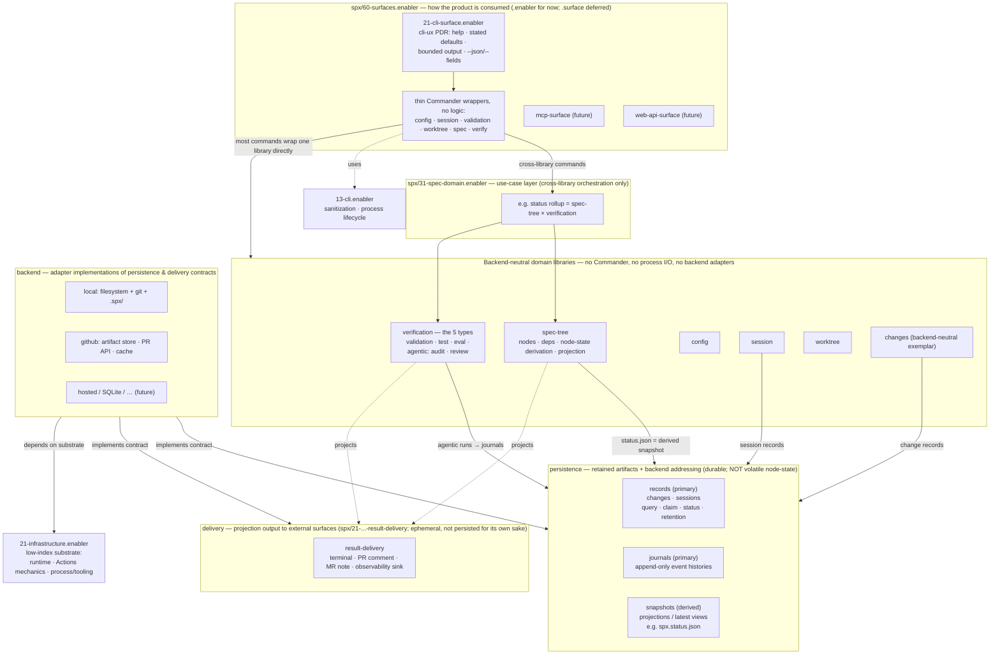
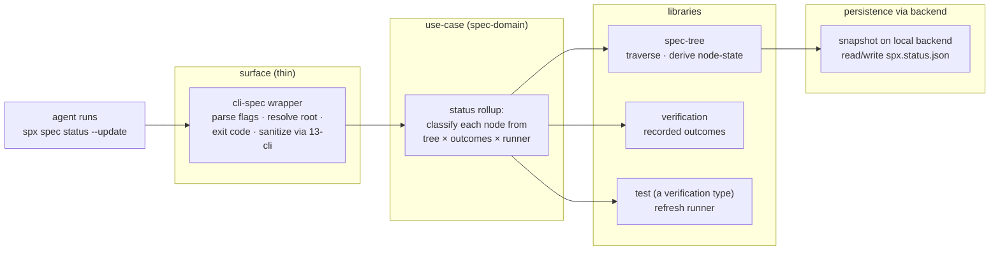

# Root coordination plan: library / persistence / surface restructuring

This note records the restructuring of spx into clean, orthogonal layers: **surfaces** (how the product is consumed), **use-cases** (cross-library orchestration), **domain libraries**, **persistence** (durable storage — records, journals, snapshots), **delivery** (projection to external surfaces), and **backend** (adapter implementations of persistence and delivery). Product truth lives in `spx/spx.product.md`, decisions, specs, tests, and source; this file records the target architecture, the delivery order that reaches it, and an index of every descendant `PLAN.md`. It is not product truth, and it steers work only after each note is reconciled against the durable layers.

The harness-vocabulary sweep (terminology renames) is a separate axis tracked node-locally; it is not part of this restructuring and interacts only through slice sequencing on shared nodes.

## Why this restructuring exists

Agents cannot reliably place work, and the failures are structural:

- **Library vs surface is decided fresh each time.** Five domains independently arrived at the thin-CLI-wrapper pattern — `spx/16-config.enabler/21-config-cli.enabler`, `spx/36-session.enabler/76-session-cli.enabler`, `spx/38-worktree.enabler/43-worktree-cli.enabler`, `spx/41-validation.enabler/21-validation-cli.enabler`, and `spx/31-spec-domain.enabler/54-spec-cli-commands.enabler` — each at a different index, under a different parent, with a different local name. The pattern works but is not structurally enforced, so nothing forces a new domain onto it.
- **The catalyst that tried to fix this made it worse, and that is the anti-pattern to correct.** The verification-owned journal had no CLI-wrapper child; its spec and governing decision declare seven verbs (`open`, `append`, `read`, `seal`, `render`, `list`, `read-set`) while framing the journal as substrate beneath the public verification-run command family. The catalyst slice "fixed" this by moving the whole journal node **wholesale** into `spx/60-surfaces.enabler/21-cli-surface.enabler/21-journal.enabler/` — carrying its persistence logic (`src/domains/journal/`: run-state, run-scope, backend selection) and its substrate decision (`11-journal-channel.adr.md`) into the surface layer. That directly violates the surface contract (`spx/60-surfaces.enabler/surfaces.md`: *a surface node never owns product-library semantics*). The correct operation is to split a fused node **in place** and move only the thin wrapper up; a functional node is never moved wholesale.
- **Logic that belongs in SPX is stop-gapped in plugin Python.** The plugin's `12-shipped-scripting.adr.md` decides that proven, test-bearing logic lives in SPX, consumed as a trusted third party through its command surface. The plugin's `project-run-journal` skill projection (`journal_projection.py` and siblings) is an explicit stop-gap "until review-specific validation moves into SPX." So verification projection, validation, and classification are SPX-destined library or use-case behavior; the CLI surface exposes that behavior without owning it.

## The corrected model

Three orthogonal concerns sit below the domain libraries. The catalyst's core mistake was conflating them:

- **persistence** — retained product artifacts and their backend addressing, in three semantic categories: **records** (primary durable records with query / claim / status / retention — `changes`, `sessions`), **journals** (primary append-only event histories), and **snapshots** (durable views *derived* from another source — e.g. `spx.status.json`). Persistence survives until removed or garbage-collected — a GitHub artifact lives 90 days, a local run-journal until GC. It is **not** `state`: a node's lifecycle state (declared / specified / passing) flips in a moment. Persistence currently lives, mis-named, in `spx/18-state.enabler` — the rename target is `spx/18-persistence.enabler`.
- **delivery** — projection output to external, user-facing surfaces (terminal output, GitHub PR comment, GitLab MR note, observability sink). Ephemeral: it survives only in the external surface, never persisted for its own sake. It is `spx/21-infrastructure.enabler/21-result-delivery.enabler`.
- **backend** — the concrete adapter implementing a persistence or delivery contract (local filesystem + git + `.spx/`; GitHub artifact store + PR API + cache; future hosted). `backend` is already reserved product vocabulary in `spx/11-methodology-vocabulary.pdr.md` and is the implementation-axis term; the `spx/23-spec-tree.enabler/24-materialization.enabler` node renames to it, while `materialization` stays reserved until its overloaded uses are reconciled (methodology-vocabulary note below). It is orthogonal to the persistence categories and to delivery. Backends consume their persistence or delivery contracts and consume low-index infrastructure substrate such as GitHub Actions mechanics; backend semantics are not owned by the infrastructure node that supplies the substrate. (A future `impl` axis — distinct front-end implementations, e.g. one terminal-styling library versus another — is imaginable but not modeled now.)

**persistence × backend is a matrix.** A journal on the local backend is `spx/18-state.enabler/71-appendable-journal-store.enabler`; a journal on the GitHub backend currently sits at `spx/21-infrastructure.enabler/43-github-ci.enabler/21-artifact-journal-store.enabler`, which is a current misplacement: it depends on GitHub infrastructure substrate and must move under the future persistence/backend owner. The abstract append-only port is `spx/15-agent-run-journal.enabler`. `changes` (`.spx/changes/`) and `sessions` are **records**, not snapshots — primary durable records, each with its own backend addressing. `spx.status.json` is a **snapshot** (derived from test evidence), and snapshot-as-a-category is under-built today — the derived current-values are scattered with no unified snapshot store. The former `.spx/reviews/` thread-store is dead and not part of this. Note that `spx/21-infrastructure.enabler/43-github-ci.enabler/21-snapshot-adapter.enabler` currently does two jobs — persist a run to an Actions artifact (**persistence**) *and* render its projection to a PR comment (**delivery**); the delivery/persistence line runs straight through it, so the target splits it and moves each backend half under the owner whose contract it implements.

**Methodology vocabulary (`spx/11-methodology-vocabulary.pdr.md`).** The methodology PDR reserves and defines the full target vocabulary — `persistence` (records / journals / snapshots), `delivery`, `backend`, `materialization`, `state`, and `status` — with `state` and `status` defined broadly enough to admit qualified run/journal compounds (a run's terminal status, a journal's sealed state), and a stated rule that a qualified compound specializes a reserved term rather than redefining its base meaning. Per durable-map the PDR declares this product truth ahead of implementation; specs whose base-term usage predates it align downstream as the persistence/backend infrastructure is built additively (vocabulary-alignment list below), not by weakening the PDR. Per that PDR's ALWAYS rule the product-wide decision changes before lower layers consume a new methodology term; delivery-order step 2 (below) is this reservation.

**Vocabulary alignment (first-affected specs).** These durable specs currently apply a reserved base term in a divergent sense and align as the persistence/backend infrastructure is built additively (delivery-order steps 4–5), not by weakening the PDR:

- `spx/23-spec-tree.enabler/spec-tree.md` — its library surface names `source records` and `tree snapshots`; align these to the persistence categories or restate them as qualified compounds.
- `spx/21-infrastructure.enabler/43-github-ci.enabler/21-snapshot-adapter.enabler/snapshot-adapter.md` — its `Snapshot` backend/kind names a backend, not the snapshot category; align the naming to `backend` when the adapter splits into its persistence and delivery halves (step 4).
- `spx/23-spec-tree.enabler/24-materialization.enabler` — names a backend `materialization`; renames to `backend` (descendant index; step 4).
- `spx/17-state.adr.md`, `spx/18-state.enabler`, `spx/15-worktree-management.pdr.md`, and `spx/spx.product.md` — use `state` for stored/persisted data (`session state`, `branch-scoped local state`, `persisted state`), a storage sense the qualified-compounds rule does not cover (it is not a lifecycle standing); that sense moves to `persistence` (18-state → 18-persistence, step 4).
- `spx/34-verification.enabler/32-verify.enabler/**` — `terminal status` and `sealed state` are qualified run/journal compounds, compatible under the qualified-compounds rule; no rename required.

**Verification is the five types, and it consumes persistence — it does not contain it.** `validation`, `test`, `eval`, and the agentic pair `audit` / `review` are all verification types (`spx/34-verification.enabler`, with `spx/41-test.enabler` and `spx/41-validation.enabler` re-homed as types, not peers). Only the agentic runs stream through `journal` persistence; `test` / `validation` record last-run evidence (snapshot). `journal` is never nested under verification — nesting it there is the coupling that fused the journal in the first place.

**`spx verification run` is the decided SPX home for verification projection and validation** — not an open product fork. `src/domains/verify/verify.ts` already holds the typed finding validation, disposition typing, input replay, and idempotency the plugin stop-gap awaits; the remaining lifecycle — `spx/34-verification.enabler/32-verify.enabler` (its cross-lifecycle verb mapping) and its child `43-terminal-projection.enabler` (finish / status / render) — is still `spx/EXCLUDE`-gated. The journal is the backend-neutral channel/substrate `spx verification run` writes through. The plugin decisions already require this; the SPX side is simply unfinished.

The layering is concrete. Trace `spx spec status --update`:

The classification ("passing only when every linked reference passes; any unexecuted reference records `not-run`") spans spec-tree, verification, and test, so it belongs in no single library, and a future `mcp spec status` must reuse it, so it belongs in no CLI wrapper. That forces the use-case layer `spx/31-spec-domain.enabler` between surfaces and libraries. A command with no cross-library orchestration (`spx config show`) skips the layer and its wrapper calls the library directly — the use-case layer is per-need, not per-domain.

## The exemplar: the changes domain

`spx/25-outcomeeng.enabler/31-changes.enabler` already works out the backend-neutral pattern this restructuring generalizes: one neutral record model (`21-change-store.pdr.md` — `handle`, `id`, `title`, `maturity`, `nodes`, `priority`, `blocked_by`, `backend_status`) over N backends (worktree `.spx/changes/`, hosted trackers), each mapping its own labels into shared query / selection / claimability semantics. It is a primary **records** store (not a derived snapshot), provably distinct from sessions (`NEVER: session files are change records`), and it is spec'd but not yet implemented in `src/`. It is the first domain build, after the vocabulary reservation of delivery-order step 2 (its change-store authors durable `records` consumers).

## Migration policy: additive, never wholesale

Build the target infrastructure first, migrate consumers (including plugin skills) onto it, then retire the old — always additive. Never move a functional, shared node wholesale; that bricks the skills mid-flight, as the catalyst did. The `.surface` node type — which the changes plan and the methodology vocabulary anticipate — is **deferred**: it is low value and highly disruptive (spec-tree filename grammar, kind registry, validation, naming-schema version), so it is not an early step. The surface layer stays `.enabler`-typed (`spx/60-surfaces.enabler`) until `.surface` is worth the migration cost.

## Delivery order

1. **This plan + its descendant-PLAN updates merge first.** (Merged in PR #349.)
2. **Reserve the target methodology vocabulary** — `spx/11-methodology-vocabulary.pdr.md` reserves and defines the full target vocabulary — `persistence` (records / journals / snapshots), `delivery`, `backend`, `materialization`, `state`, and `status` — admitting qualified compounds; specs whose base-term usage predates it align downstream (vocabulary-alignment list above). This reservation precedes every durable consumer, because the changes-domain build next authors durable specs, decisions, and source that use `records`.
3. **The changes domain** — net-new, non-disruptive, the worked example. Build `change-store` + its worktree records backend + `.spx/changes/` scope addressing (`spx/25-outcomeeng.enabler/31-changes.enabler/PLAN.md` steps 3, 4, 6), deferring the `.surface` CLI. Touches no live journal / verify / skill infrastructure.
4. **Persistence + verification foundation** (additive): name and lift `records` / `journals` / `snapshots` into a top-level persistence concern orthogonal to verification (rename `spx/18-state.enabler` → `spx/18-persistence.enabler`); finish `spx verification run` (`spx/34-verification.enabler/32-verify.enabler/43-terminal-projection.enabler`) as the SPX projection/validation home; migrate the plugin skills off their Python stop-gap; then retire the journal's surface misplacement, move GitHub persistence backend semantics out of `spx/21-infrastructure.enabler/43-github-ci.enabler`, and split `spx/21-infrastructure.enabler/43-github-ci.enabler/21-snapshot-adapter.enabler` into its persistence and delivery halves.
5. **Surface wrapper migration**: move the genuinely-thin CLI wrappers (config, session, validation, worktree) into `spx/60-surfaces.enabler/21-cli-surface.enabler/`, one reviewable slice each; split `spec-cli-commands` and `verify` so only the thin binding moves and the use-case / library behavior stays.
6. Index re-settlement, the `.surface` node type, and the `author-cli-domain` / `audit-cli-domain` skill pair, once their prerequisites exist.

Each later step is sequenced so the target infrastructure exists before any consumer migrates, and no functional node is moved wholesale.

## Open questions (for `/decompose` + `/interview`)

| Question                                                                                                                                                  | Status                                                                                              |
| --------------------------------------------------------------------------------------------------------------------------------------------------------- | --------------------------------------------------------------------------------------------------- |
| Does `spx/31-spec-domain.enabler` keep its name or generalize to a product-wide `application` use-case layer?                                             | Open; `/decompose` + `/interview` after the persistence / verify split settles its remaining scope. |
| Index re-settlement: `spec-domain` (31) and `verification` (34) above `41-test`; `13-cli`'s relation to the surface.                                      | Deferred to `/decompose`; both invert the ordering rule at current indices.                         |
| The `snapshot` (derived) category: one unified store, or per-consumer (status.json, last-run)? Do `records` (changes, sessions) share one store contract? | Open; settle when snapshot-local and the records store are built.                                   |

Resolved by this discussion (no longer open): the verify / journal boundary (SPX owns projection and validation via `spx verification run`; journal is the substrate); journal `list` and `read-set` are journal verbs per `spx/60-surfaces.enabler/21-cli-surface.enabler/21-journal.enabler/11-journal-channel.adr.md`; the persistence-vs-backend axes and their names (`persistence` with records / journals / snapshots, `backend`, `delivery`; `state` reserved for volatile node lifecycle); `.surface` sequencing (deferred).

## Preserved evidence

- The prior foundation-ownership articulation's node-local coordination survives on `main` from `a52b0e89`: the placeholder directories `spx/23-spec-tree.enabler/24-materialization.enabler/` (`21-filesystem-git-backend.enabler`, `32-executable-operations.enabler`, PLAN-only) and the ownership-repair sections in `spx/23-spec-tree.enabler/PLAN.md` and `spx/31-spec-domain.enabler/PLAN.md`. Build on them; `/decompose` and `/author` turn the placeholders into specs (renamed to `backend` per this plan).
- The stale branch `work/node-status-staleness` (origin tip `e5f8aa67`; far behind `main`, unmaintained) holds an implementation attempt whose *code* must not be resurrected as architecture; only its filesystem facts are evidence inventory. The commit is pinned so the evidence stays recoverable if the branch is pruned.

## Per-slice gates

Each slice starts from current `origin/main`, loads context with `/contextualize`, uses `/refactor` for structural moves and `/apply` for implementation. Before merge, each slice runs the matching verifier agents: `pdr-auditor` for PDR edits, `adr-auditor` for ADR edits, `spec-auditor` for changed specs, `test-evidence-auditor` for test edits, `auditor` for TypeScript source edits, and `changes-reviewer` for the whole changeset. Local deterministic gates are `pnpm run validate`, focused `spx test spx/<node>` for changed implementation or tests, and `pnpm run build` before push when source changes. Commits go through `/commit-changes`; delivery goes through `/merge`.

## Descendant `PLAN.md` index

Every node-local `PLAN.md`, so future syncs are a checklist. **R** = restructuring-linked (kept consistent with the corrected model above; every R note carries a reconciliation header pointing here and is reconciled against this plan before use). **I** = independent node-local work (not touched by this restructuring; indexed only).

| Path                                                                                                                           | Link | Note                                                                                                  |
| ------------------------------------------------------------------------------------------------------------------------------ | ---- | ----------------------------------------------------------------------------------------------------- |
| `spx/15-agent-run-journal.enabler/PLAN.md`                                                                                     | R    | append-only journal port — a persistence kind, not a verification concern                             |
| `spx/16-config.enabler/PLAN.md`                                                                                                | R    | config library; its CLI wrapper moves to the surface                                                  |
| `spx/16-config.enabler/32-shared-config-primitives.enabler/PLAN.md`                                                            | I    | shared config primitives                                                                              |
| `spx/16-config.enabler/43-domain-execution-descriptors.enabler/PLAN.md`                                                        | R    | references the audit/review → journal collapse (the catalyst misplacement); reconcile                 |
| `spx/16-config.enabler/54-canonical-descriptor-digest.enabler/PLAN.md`                                                         | I    | descriptor digest                                                                                     |
| `spx/17-file-inclusion.enabler/PLAN.md`                                                                                        | I    | file-inclusion path filters                                                                           |
| `spx/17-file-inclusion.enabler/65-domain-path-filters.enabler/PLAN.md`                                                         | I    | domain path filters                                                                                   |
| `spx/18-state.enabler/PLAN.md`                                                                                                 | R    | mis-named persistence home (rename → `spx/18-persistence.enabler`); persistence lifts here            |
| `spx/21-infrastructure.enabler/PLAN.md`                                                                                        | R    | low-index substrate; GitHub backend semantics move out                                                |
| `spx/21-infrastructure.enabler/11-atomic-file-write.enabler/PLAN.md`                                                           | I    | atomic file write                                                                                     |
| `spx/21-infrastructure.enabler/21-result-delivery.enabler/PLAN.md`                                                             | R    | the `delivery` layer                                                                                  |
| `spx/21-infrastructure.enabler/43-code-quality-analysis.enabler/PLAN.md`                                                       | I    | code-quality analysis                                                                                 |
| `spx/23-spec-tree.enabler/PLAN.md`                                                                                             | R    | logical foundation; `materialization` → `backend`                                                     |
| `spx/23-spec-tree.enabler/24-materialization.enabler/PLAN.md`                                                                  | R    | `backend` layer (rename); persistence/backend split                                                   |
| `spx/23-spec-tree.enabler/24-materialization.enabler/21-filesystem-git-backend.enabler/PLAN.md`                                | R    | local `backend`                                                                                       |
| `spx/23-spec-tree.enabler/24-materialization.enabler/32-executable-operations.enabler/PLAN.md`                                 | R    | executable operations under `backend`                                                                 |
| `spx/23-spec-tree.enabler/32-spec-tree-source.enabler/PLAN.md`                                                                 | R    | source adapter boundary opened by backend restructuring                                               |
| `spx/23-spec-tree.enabler/48-skill-conformance-oracle.enabler/PLAN.md`                                                         | I    | skill-conformance oracle                                                                              |
| `spx/23-spec-tree.enabler/76-node-state-derivation.enabler/PLAN.md`                                                            | R    | node-state (volatile) vs persistence naming                                                           |
| `spx/23-spec-tree.enabler/87-spec-tree-projection.enabler/PLAN.md`                                                             | R    | projection contract depends on state/backend boundaries                                               |
| `spx/25-outcomeeng.enabler/31-changes.enabler/PLAN.md`                                                                         | R    | the exemplar and first build; `.surface` deferred                                                     |
| `spx/25-outcomeeng.enabler/31-spec-tree.enabler/PLAN.md`                                                                       | R    | Outcome Engineering graph semantics over Spec Tree represented artifacts                              |
| `spx/25-outcomeeng.enabler/31-spec-tree.enabler/21-graph.enabler/PLAN.md`                                                      | R    | graph aggregate; spec → test → source truth-flow ordering                                             |
| `spx/25-outcomeeng.enabler/31-spec-tree.enabler/21-graph.enabler/43-source.enabler/PLAN.md`                                    | R    | source ownership graph; Outcome Engineering graph core boundary                                       |
| `spx/25-outcomeeng.enabler/31-spec-tree.enabler/21-graph.enabler/43-source.enabler/32-typescript-source-graph.enabler/PLAN.md` | R    | TypeScript provider coordination: Vitest/Vite coverage plus TypeScript compiler API or ts-morph facts |
| `spx/25-outcomeeng.enabler/31-spec-tree.enabler/21-graph.enabler/43-source.enabler/32-python-source-graph.enabler/PLAN.md`     | R    | Python provider coordination: coverage.py plus grimp facts                                            |
| `spx/25-outcomeeng.enabler/31-spec-tree.enabler/21-graph.enabler/43-source.enabler/32-rust-source-graph.enabler/PLAN.md`       | R    | Rust provider coordination: cargo llvm-cov plus rust-analyzer facts                                   |
| `spx/26-release.enabler/21-release-data.enabler/PLAN.md`                                                                       | I    | release data                                                                                          |
| `spx/26-release.enabler/32-release-notes.enabler/PLAN.md`                                                                      | I    | release notes                                                                                         |
| `spx/31-spec-domain.enabler/PLAN.md`                                                                                           | R    | use-case layer; consumer boundary                                                                     |
| `spx/31-spec-domain.enabler/21-node-status.enabler/PLAN.md`                                                                    | R    | status/state semantics evacuate to spec-tree + persistence                                            |
| `spx/31-spec-domain.enabler/43-context-ingestion.enabler/PLAN.md`                                                              | I    | context ingestion                                                                                     |
| `spx/33-harness-environment.enabler/PLAN.md`                                                                                   | I    | harness-vocabulary axis                                                                               |
| `spx/33-harness-environment.enabler/21-agent-instructions.enabler/PLAN.md`                                                     | I    | harness-vocabulary axis                                                                               |
| `spx/33-harness-environment.enabler/32-agent-config.enabler/PLAN.md`                                                           | I    | harness-vocabulary axis                                                                               |
| `spx/33-harness-environment.enabler/43-plugin-bootstrap.enabler/PLAN.md`                                                       | I    | harness-vocabulary axis                                                                               |
| `spx/34-verification.enabler/PLAN.md`                                                                                          | R    | verification = 5 types; `spx verification run` is the SPX projection home                             |
| `spx/36-session.enabler/PLAN.md`                                                                                               | R    | session library; its CLI wrapper moves to the surface                                                 |
| `spx/38-worktree.enabler/PLAN.md`                                                                                              | R    | worktree library; its CLI wrapper moves to the surface                                                |
| `spx/41-test.enabler/PLAN.md`                                                                                                  | R    | a verification type, re-homed under verification                                                      |
| `spx/41-test.enabler/90-targeted-execution.enabler/PLAN.md`                                                                    | I    | targeted execution                                                                                    |
| `spx/41-validation.enabler/PLAN.md`                                                                                            | R    | a verification type, re-homed under verification                                                      |
| `spx/41-validation.enabler/32-python-validation.enabler/PLAN.md`                                                               | I    | python validation                                                                                     |
| `spx/41-validation.enabler/32-typescript-validation.enabler/32-literal-reuse.enabler/PLAN.md`                                  | I    | literal-reuse cleanup                                                                                 |
| `spx/46-agent.enabler/PLAN.md`                                                                                                 | I    | agent enabler                                                                                         |
| `spx/46-claude.outcome/PLAN.md`                                                                                                | I    | claude outcome                                                                                        |
| `spx/46-claude.outcome/21-settings-consolidation.outcome/PLAN.md`                                                              | I    | settings consolidation                                                                                |
| `spx/54-diagnose.enabler/PLAN.md`                                                                                              | I    | diagnose                                                                                              |
| `spx/60-surfaces.enabler/PLAN.md`                                                                                              | R    | surface-layer pointers; CLI surface is the active concrete surface restructuring                      |
| `spx/60-surfaces.enabler/21-cli-surface.enabler/PLAN.md`                                                                       | R    | CLI command-surface governance and verification command-family target structure                       |
| `spx/60-surfaces.enabler/21-cli-surface.enabler/15-command-surface-governance.enabler/PLAN.md`                                 | R    | shared public command vocabulary and command-surface enforcement child grouping                       |
| `spx/60-surfaces.enabler/21-cli-surface.enabler/21-verification-command-family.enabler/PLAN.md`                                | R    | verification-run command-family child grouping                                                        |
| `spx/60-surfaces.enabler/21-cli-surface.enabler/21-journal.enabler/PLAN.md`                                                    | R    | catalyst misplacement; substrate splits back per delivery-order step 4                                |

## Superseded

The earlier "Program A / B / C" framing and the "catalyst placement is the fix" framing are superseded by the corrected model above. Their still-valid content — the thin-wrapper evidence, the spec-domain use-case layer, the index re-settlement, the foundation-ownership repair — is folded into the layered target and the delivery order; their premise (the CLI-surface catalyst as the organizing idea, the journal wholesale-move as progress) is not.
