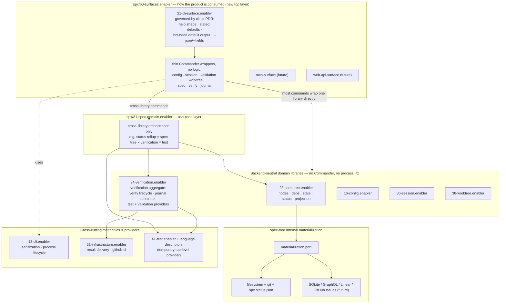
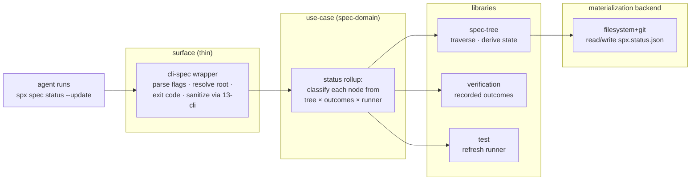

# Root coordination plan: library / surface restructuring

This note records the structural restructuring of spx toward a clean library / surface separation. Product truth remains in `spx/spx.product.md`, decisions, specs, tests, and source; this file records the target architecture and the delivery order that reaches it. It is not product truth, and it steers work only after each note is reconciled against the durable layers.

The terminology work (harness vocabulary renames) is a separate axis, tracked node-locally — see "Harness vocabulary sweep" at the end. It is not part of this restructuring and only interacts with it through slice sequencing on the shared nodes.

## Why this restructuring exists

Agents cannot reliably place CLI-facing work, and the failures are structural rather than accidental:

- `spx/23-spec-tree.enabler` already declares itself a backend-neutral library, and `spx/31-spec-domain.enabler/54-spec-cli-commands.enabler` already declares itself a thin wrapper over it. The split works here, but the name `spec-domain` does not read as "CLI surface," so an agent scanning node names misses the boundary this pair already enforces.
- Four more domains independently arrived at the same thin-wrapper pattern — `spx/16-config.enabler/21-config-cli.enabler`, `spx/36-session.enabler/76-session-cli.enabler`, `spx/38-worktree.enabler/43-worktree-cli.enabler`, `spx/41-validation.enabler/21-validation-cli.enabler` — each at a different index, under a different parent, with a different local name. Five correct instances with no single discoverable location prove the pattern works but is not structurally enforced.
- The former verification-owned journal node was the counter-example: no CLI-wrapper child existed at all. Its spec declared seven verbs (`open`, `append`, `read`, `seal`, `render`, `list`, `read-set`) as one undifferentiated set, while its own governing decision declared an invariant of exactly five (`open`, `append`, `read`, `seal`, `render`) "identical for every verification kind and every backend," framing the journal as substrate beneath `spx verify`'s public lifecycle. `list` and `read-set` were baked directly into the substrate node with no ADR authorization and no surface node to hold them.

The fix removes the per-domain judgment call: one unmissable surface layer for every command's binding, verbs, and help text, and interface-neutral logic left in libraries below it, so "library or surface" is never decided fresh.

## Target architecture



The layering is concrete, not aspirational. Trace `spx spec status --update`:



The classification ("passing only when every linked reference passes; any unexecuted reference records `not-run`") spans spec-tree, verification, and test, so it belongs in no single library. A future `mcp spec status` must reuse it, so it belongs in no CLI wrapper. That forces a use-case layer between surfaces and libraries — which is what `spx/31-spec-domain.enabler` becomes. A command with no cross-library orchestration (`spx config show`) skips the layer and its wrapper calls the library directly. The use-case layer is per-need, not per-domain.

This PR uses `60-surfaces.enabler` as the catalyst placement: 60 sits above every wrapped domain library (the highest current root index is 54), consistent with surface-consumes-library ordering. Later `/decompose` can still refine neighboring root indices, but it must preserve the surface-consumes-library direction rather than moving CLI surface contracts back below their libraries.

The target-architecture diagram's consumer edges also outrun the current indices, and `/decompose` re-settles them the same way: `spx/31-spec-domain.enabler` (index 31) as a use-case consumer of `spx/34-verification.enabler` (34) and `spx/41-test.enabler` (41), and `spx/34-verification.enabler` as a consumer of `spx/41-test.enabler`, both invert the ordering rule (lower = provider) at their present indices. A consumer of `41-test.enabler` must sit above it, so both `spec-domain` and `verification` require index re-settlement above `41` — deferred to `/decompose` alongside the surfaces index, not fixed here.

Additional correction: `spx/41-test.enabler` and `spx/41-validation.enabler` are verification providers, not permanent peer product domains. They remain top-level only as a transitional layout. The verification restructuring must move or re-home their interface-neutral behavior under the verification aggregate before their CLI surfaces are treated as ordinary wrappers under `spx/60-surfaces.enabler/21-cli-surface.enabler/`.

## Program B: foundation ownership repair

A prior articulation of this program was removed from *root* by `13d14014` → `53790d8a` → `754f6c8e`, but its node-local coordination survives on `main` from `a52b0e89` and must be built on, not re-derived: the placeholder directories `spx/23-spec-tree.enabler/24-materialization.enabler/` (with `21-filesystem-git-backend.enabler` and `32-executable-operations.enabler`, PLAN-only — no specs yet) and the ownership-repair sections in `spx/23-spec-tree.enabler/PLAN.md` and `spx/31-spec-domain.enabler/PLAN.md`. `/decompose` and `/author` turn those placeholders into specs. Separately, the stale branch `work/node-status-staleness` (origin tip `e5f8aa67` when this was written; far behind `main` and not maintained) holds an implementation attempt whose *code* must not be resurrected as architecture; only its filesystem facts are evidence inventory. The commit is pinned here so the evidence stays recoverable even if the branch is later pruned.

### Target ownership model

| Layer                  | Owner                                                   | Responsibility                                                                                                                                                                                                                                                   |
| ---------------------- | ------------------------------------------------------- | ---------------------------------------------------------------------------------------------------------------------------------------------------------------------------------------------------------------------------------------------------------------- |
| Methodology vocabulary | `spx/11-methodology-vocabulary.pdr.md` (already exists) | Product-wide vocabulary every later node uses: durable map, node, dependency order, decision reach, assertion, evidence, status, state, materialization, provider, consumer, interface. Amend it if a term is incomplete; do not author a second methodology PDR |
| Logical foundation     | `spx/23-spec-tree.enabler/`                             | Node identity, dependency-graph semantics, state derivation, status semantics, projection contracts, logical operations                                                                                                                                          |
| Materialization        | a child under `spx/23-spec-tree.enabler/`               | Backend contract: current state, history, per-node metadata, dependency queries, evidence records, executable operations                                                                                                                                         |
| Filesystem backend     | grandchild under materialization                        | Tracked `spx/` files, git history, `.spx/` evidence, `spx.status.json` as filesystem per-node metadata                                                                                                                                                           |
| Testing provider       | `spx/41-test.enabler/`                                  | Runner adapters, discovery, language descriptor dispatch, language-owned product-input discovery                                                                                                                                                                 |
| Use-case layer         | `spx/31-spec-domain.enabler/`                           | Application use-cases as calls into the foundation — cross-library orchestration only                                                                                                                                                                            |

Correction against the removed articulation: it listed `spx/31-spec-domain.enabler` as owning "CLI and API request parsing" and "terminal/API/MCP/UI rendering contracts." Those belong to the surface layer (Program C), not the use-case layer. B keeps only "application-level use-cases as calls into the foundation."

### Main diagnosis

- `spx/31-spec-domain.enabler/21-node-status.enabler/` holds state, status, staleness, and filesystem-metadata behavior that belongs in the spec-tree logical foundation and its materialization backend.
- `spx/23-spec-tree.enabler/` provides source, assembly, traversal, state derivation, and projection, but does not yet own the full state / status / materialization model.
- `spx/41-test.enabler/` owns runner mechanics, but status staleness currently reaches into language-specific TypeScript import discovery from the wrong layer.

### Repair sequence

1. `/decompose spx/` settles the runtime-ADR relocation (the methodology PDR already sits at `spx/11-methodology-vocabulary.pdr.md` — no placement needed).
2. `/author` amends `spx/11-methodology-vocabulary.pdr.md` only if the repair surfaces a vocabulary term it does not already define; it does not author a new methodology PDR.
3. `/decompose spx/23-spec-tree.enabler` settles materialization, filesystem backend, executable operations, and state / status / projection boundaries.
4. `/author` creates or amends specs and ADRs under `spx/23-spec-tree.enabler`.
5. Amend `spx/31-spec-domain.enabler` and `spx/31-spec-domain.enabler/21-node-status.enabler` to record evacuation of state / status / storage semantics to the provider.
6. Amend `spx/41-test.enabler` so language descriptors own product-input expansion for testing freshness and status dependency inputs.
7. `/apply` the implementation migration: logical state / status behavior moves into spec-tree; filesystem / git / status-file behavior becomes the materialization backend; TypeScript import expansion moves into the TypeScript testing descriptor path; spec-domain narrows to use-case orchestration.

## Program C: CLI-surface / library boundary

### Target ownership model

| Layer                            | Owner                                                                                                                                                                                 | Responsibility                                                                                                                                         |
| -------------------------------- | ------------------------------------------------------------------------------------------------------------------------------------------------------------------------------------- | ------------------------------------------------------------------------------------------------------------------------------------------------------ |
| Product-wide surface conventions | `spx/60-surfaces.enabler/`                                                                                                                                                            | Cross-cutting conventions each concrete surface follows — help shape, stated defaults, bounded agent-safe default output, `--json`/`--fields` symmetry |
| CLI command surface              | `spx/60-surfaces.enabler/21-cli-surface.enabler/`                                                                                                                                     | Every CLI command's Commander binding, verbs, flags, help text — thin composing wrappers only                                                          |
| Domain logic libraries           | `spx/16-config.enabler`, `spx/36-session.enabler`, `spx/38-worktree.enabler`, and verification-owned providers after `spx/41-test.enabler` / `spx/41-validation.enabler` are re-homed | Domain logic only, consumed by its CLI wrapper through a stable surface — no Commander concerns                                                        |

### Desired top-level structure

```text
spx/
├── 13-cli.enabler/                      # sanitization + process lifecycle mechanics — scope unchanged
├── 60-surfaces.enabler/
│   └── 21-cli-surface.enabler/
│       ├── {config, session, validation, worktree, spec, verify, journal}-cli children moved or created here
├── 16-config.enabler/                   # library only, once its CLI child moves out
├── 23-spec-tree.enabler/                # already library-only (Program B deepens it)
├── 31-spec-domain.enabler/              # use-case layer, once spec-cli-commands moves out
├── 34-verification.enabler/             # verification aggregate, once journal-cli and verify-cli move out
├── 36-session.enabler/                  # library only, once session-cli moves out
├── 38-worktree.enabler/                 # library only, once worktree-cli moves out
├── 41-test.enabler/                     # temporary top-level verification provider until re-homed
└── 41-validation.enabler/               # temporary top-level verification provider until re-homed
```

### Migration sequence

1. This catalyst creates `spx/60-surfaces.enabler/21-cli-surface.enabler` at the high surface index and moves the current journal CLI node there. Follow-up `/decompose spx/` settles `spx/13-cli.enabler`'s relationship to the surface node (same-index peer, ordered, or absorbed), re-settles `spx/31-spec-domain.enabler`, and re-homes `spx/41-test.enabler` / `spx/41-validation.enabler` under verification before the larger wrapper migration continues.
2. `/interview` resolves the open questions below wherever the ordering-evidence matrix cannot settle them from existing text.
3. This catalyst authors the CLI-surface UX-contract PDR inside `spx/60-surfaces.enabler/21-cli-surface.enabler/` — inline enum values, stated defaults, bounded default output, `--json`/`--fields` symmetry with `spx session list`'s pattern. It also relocates the verify-command surface PDR to `spx/60-surfaces.enabler/21-cli-surface.enabler/13-verify-command-surface.pdr.md`, making it surface context rather than verification-library context.
4. `/refactor` moves the genuinely-thin CLI wrappers — `config-cli`, `session-cli`, `validation-cli`, `worktree-cli` — into `spx/60-surfaces.enabler/21-cli-surface.enabler/`, one domain per reviewable slice. `spec-cli-commands` is not a clean wholesale move: it still owns cross-library use-case behavior — the `spx spec status --update` classification, resolver delegation, and partial-run semantics governed by `spx/31-spec-domain.enabler/54-spec-cli-commands.enabler/21-status-testing-delegation.adr.md` — which the target architecture keeps in the spec-domain use-case layer. Split it as steps 5 and 6 do: the use-case orchestration stays in `spx/31-spec-domain.enabler`, and only the thin Commander binding moves to the surface.
5. This catalyst moves the current `spx journal` CLI node under `spx/60-surfaces.enabler/21-cli-surface.enabler/21-journal.enabler` as a transitional surface node. A follow-up `/author` plus `/apply` splits any remaining interface-neutral journal substrate back into verification-owned library nodes, resolving `list`/`read-set` per whichever direction the open question below settles.
6. `/refactor` moves the existing `spx verify` CLI surface into `21-cli-surface.enabler` as a `verify-cli` wrapper — `spx verify` is not missing: `spx/60-surfaces.enabler/21-cli-surface.enabler/13-verify-command-surface.pdr.md`, `spx/34-verification.enabler/32-verify.enabler/`, and the `src/interfaces/cli/verify.ts` implementation already exist. The migration relocates that wrapper and leaves the verify library behavior in `spx/34-verification.enabler`, the same split step 4 applies to the other domains.
7. Author the `author-cli-domain` / `audit-cli-domain` skill pair once the PDR and at least one migrated domain exist as a worked example.

Every split or relocation step above rewrites the affected node's spec `PROVIDES` clause to its post-migration scope, so the durable spec never claims a scope the migration moved away: `spx/31-spec-domain.enabler/spec-domain.md` changes from "deterministic CLI commands that operate on the spec tree" to the cross-library use-case layer (after step 4's split), and the verification-owned journal substrate changes away from "the `spx journal` command" once the interface-neutral remainder is split back out of the transitional surface node. Leaving a node's declaration claiming "CLI commands" after its binding has moved to the surface is the spec-versus-implementation divergence this restructuring exists to remove.

### Open structural questions for `/decompose`

| Question                                                                                                                                                                            | Candidate answer to test                                                                                                         |
| ----------------------------------------------------------------------------------------------------------------------------------------------------------------------------------- | -------------------------------------------------------------------------------------------------------------------------------- |
| Does `spx/13-cli.enabler` (sanitization, process lifecycle) move under `spx/60-surfaces.enabler`, or stay a separate root peer?                                                     | Keep separate — mechanics and UX/composition conventions are different concerns; same-index peer unless evidence proves an edge. |
| Do the five existing CLI wrappers physically move, or does only the convention PDR centralize while wrappers stay put?                                                              | Physically move — the journal counter-example proves per-domain placement does not reliably force the split.                     |
| Does journal's `list`/`read-set` stay journal verbs (amend the journal-channel invariant now located under the CLI surface) or move to `spx verify` (matching the old ADR wording)? | Open — unresolved from the investigation that led to this program.                                                               |

## Sequencing B and C, and the spec-domain resolution

B runs before C on the shared nodes. B settles what stays in `spx/23-spec-tree.enabler` versus its materialization backend, and narrows `spx/31-spec-domain.enabler` to a use-case layer; C then moves CLI bindings out against a boundary that has stopped shifting. Running C first would build wrappers against a spec-domain still being hollowed out.

Open decision neither program settles alone: after B moves status semantics into spec-tree and C moves CLI binding into surfaces, `spx/31-spec-domain.enabler` holds only cross-library orchestration. Decide via `/decompose` + `/interview` whether it keeps the name `spec-domain` (spec-tree-scoped orchestration) or generalizes into a product-wide `application` use-case layer any cross-library command uses. This target view keeps it as a real, named layer either way — the classification example above proves cross-library orchestration needs a home that is neither a library nor a surface.

## Per-slice gates

Each slice starts from current `origin/main`, loads context with `/contextualize`, and uses `/plan-slice` when the slice is selected from this program. Structural moves use `/refactor`; implementation work uses `/apply`.

Before merge, each slice runs the matching verifier agents: `pdr-auditor` for PDR edits, `adr-auditor` for ADR edits, `spec-auditor` for changed specs, `test-evidence-auditor` for test edits, `auditor` for TypeScript source edits, and `changes-reviewer` for the whole changeset.

Local deterministic gates are `pnpm run validate`, focused `spx test spx/<node>` for changed implementation or tests, and `pnpm run build` before push when source changes. Commits go through `/commit-changes`; delivery goes through `/merge`.

## Harness vocabulary (landed on main)

The harness-vocabulary alignment — a terminology sweep orthogonal to this restructuring — has landed on `main`: the environment node is now `spx/33-harness-environment.enabler`, and the product vocabulary is aligned on `spx/12-agent-harness.pdr.md`'s terms (agent harness, agent, agent adapter, agent session). Any residual per-node alignment is tracked in each affected node's `PLAN.md` — for example `spx/15-agent-run-journal.enabler`, `spx/34-verification.enabler`, `spx/36-session.enabler`, `spx/38-worktree.enabler`, and `spx/46-agent.enabler` — which `/contextualize` reads. Programs B and C build on the already-aligned versions of those nodes; no rename-versus-relocate sequencing remains.
