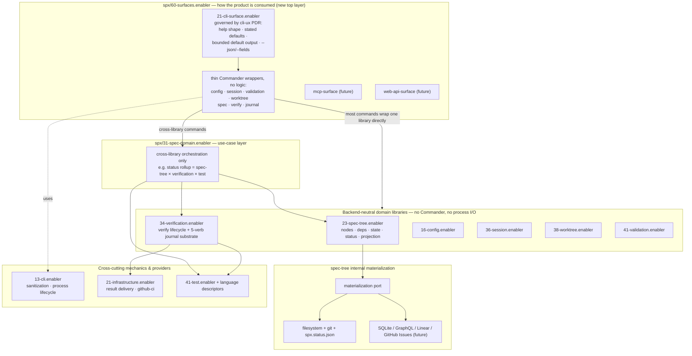
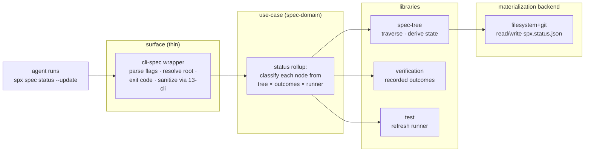

# Root coordination plan: library / surface restructuring

This note records the structural restructuring of spx toward a clean library / surface separation. Product truth remains in `spx/spx.product.md`, decisions, specs, tests, and source; this file records the target architecture and the delivery order that reaches it. It is not product truth, and it steers work only after each note is reconciled against the durable layers.

The terminology work (harness vocabulary renames) is a separate axis, tracked node-locally — see "Harness vocabulary sweep" at the end. It is not part of this restructuring and only interacts with it through slice sequencing on the shared nodes.

## Why this restructuring exists

Agents cannot reliably place CLI-facing work, and the failures are structural rather than accidental:

- `spx/23-spec-tree.enabler` already declares itself a backend-neutral library, and `spx/31-spec-domain.enabler/54-spec-cli-commands.enabler` already declares itself a thin wrapper over it. The split works here, but the name `spec-domain` does not read as "CLI surface," so an agent scanning node names misses the boundary this pair already enforces.
- Four more domains independently arrived at the same thin-wrapper pattern — `spx/16-config.enabler/21-config-cli.enabler`, `spx/36-session.enabler/76-session-cli.enabler`, `spx/38-worktree.enabler/43-worktree-cli.enabler`, `spx/41-validation.enabler/21-validation-cli.enabler` — each at a different index, under a different parent, with a different local name. Five correct instances with no single discoverable location prove the pattern works but is not structurally enforced.
- `spx/34-verification.enabler/21-journal.enabler` is the counter-example: no CLI-wrapper child exists at all. Its spec declares seven verbs (`open`, `append`, `read`, `seal`, `render`, `list`, `read-set`) as one undifferentiated set, while its own governing decision `spx/34-verification.enabler/13-journal-channel.adr.md` declares an invariant of exactly five (`open`, `append`, `read`, `seal`, `render`) "identical for every verification kind and every backend," framing the journal as substrate beneath `spx verify`'s public lifecycle. `list` and `read-set` were baked directly into the substrate node with no ADR authorization and no surface node to hold them.

The fix removes the per-domain judgment call: one unmissable surface layer for every command's binding, verbs, and help text, and interface-neutral logic left in libraries below it, so "library or surface" is never decided fresh.

## Target architecture



The layering is concrete, not aspirational. Trace `spx spec status --update`:



The classification ("passing only when every linked reference passes; any unexecuted reference records `not-run`") spans spec-tree, verification, and test, so it belongs in no single library. A future `mcp spec status` must reuse it, so it belongs in no CLI wrapper. That forces a use-case layer between surfaces and libraries — which is what `spx/31-spec-domain.enabler` becomes. A command with no cross-library orchestration (`spx config show`) skips the layer and its wrapper calls the library directly. The use-case layer is per-need, not per-domain.

The `60-surfaces.enabler` index below is a candidate, not a settled placement: 60 sits above every wrapped domain library (the highest current root index is 54), consistent with surface-consumes-library ordering, but `/decompose` confirms it from the ordering-evidence matrix before any spec is authored. Nothing under `60-surfaces.enabler` is built yet; every "desired structure" entry below is a working note.

## Program B: foundation ownership repair

A prior articulation of this program was removed from root by `13d14014` → `53790d8a` → `754f6c8e`, and its proposed node structure (materialization enablers, methodology PDR) was drafted on the stale branch `work/node-status-staleness` — 211 commits behind `main`, its own note saying its code must not be preserved as architecture. Re-derive B fresh against current `main`; do not resurrect that branch's commits.

### Target ownership model

| Layer                  | Owner                                       | Responsibility                                                                                                                                                                         |
| ---------------------- | ------------------------------------------- | -------------------------------------------------------------------------------------------------------------------------------------------------------------------------------------- |
| Methodology vocabulary | a product-root PDR (index via `/decompose`) | Product-wide vocabulary every later node uses: durable map, node, dependency order, decision reach, assertion, evidence, status, state, materialization, provider, consumer, interface |
| Logical foundation     | `spx/23-spec-tree.enabler/`                 | Node identity, dependency-graph semantics, state derivation, status semantics, projection contracts, logical operations                                                                |
| Materialization        | a child under `spx/23-spec-tree.enabler/`   | Backend contract: current state, history, per-node metadata, dependency queries, evidence records, executable operations                                                               |
| Filesystem backend     | grandchild under materialization            | Tracked `spx/` files, git history, `.spx/` evidence, `spx.status.json` as filesystem per-node metadata                                                                                 |
| Testing provider       | `spx/41-test.enabler/`                      | Runner adapters, discovery, language descriptor dispatch, language-owned product-input discovery                                                                                       |
| Use-case layer         | `spx/31-spec-domain.enabler/`               | Application use-cases as calls into the foundation — cross-library orchestration only                                                                                                  |

Correction against the removed articulation: it listed `spx/31-spec-domain.enabler` as owning "CLI and API request parsing" and "terminal/API/MCP/UI rendering contracts." Those belong to the surface layer (Program C), not the use-case layer. B keeps only "application-level use-cases as calls into the foundation."

### Main diagnosis

- `spx/31-spec-domain.enabler/21-node-status.enabler/` holds state, status, staleness, and filesystem-metadata behavior that belongs in the spec-tree logical foundation and its materialization backend.
- `spx/23-spec-tree.enabler/` provides source, assembly, traversal, state derivation, and projection, but does not yet own the full state / status / materialization model.
- `spx/41-test.enabler/` owns runner mechanics, but status staleness currently reaches into language-specific TypeScript import discovery from the wrong layer.

### Repair sequence

1. `/decompose spx/` settles placement for the methodology PDR and the runtime-ADR relocation.
2. `/author` writes the methodology PDR.
3. `/decompose spx/23-spec-tree.enabler` settles materialization, filesystem backend, executable operations, and state / status / projection boundaries.
4. `/author` creates or amends specs and ADRs under `spx/23-spec-tree.enabler`.
5. Amend `spx/31-spec-domain.enabler` and `spx/31-spec-domain.enabler/21-node-status.enabler` to record evacuation of state / status / storage semantics to the provider.
6. Amend `spx/41-test.enabler` so language descriptors own product-input expansion for testing freshness and status dependency inputs.
7. `/apply` the implementation migration: logical state / status behavior moves into spec-tree; filesystem / git / status-file behavior becomes the materialization backend; TypeScript import expansion moves into the TypeScript testing descriptor path; spec-domain narrows to use-case orchestration.

## Program C: CLI-surface / library boundary

### Target ownership model

| Layer                            | Owner                                                                                                                       | Responsibility                                                                                                                                         |
| -------------------------------- | --------------------------------------------------------------------------------------------------------------------------- | ------------------------------------------------------------------------------------------------------------------------------------------------------ |
| Product-wide surface conventions | `spx/60-surfaces.enabler/`                                                                                                  | Cross-cutting conventions each concrete surface follows — help shape, stated defaults, bounded agent-safe default output, `--json`/`--fields` symmetry |
| CLI command surface              | `spx/60-surfaces.enabler/21-cli-surface.enabler/`                                                                           | Every CLI command's Commander binding, verbs, flags, help text — thin composing wrappers only                                                          |
| Domain logic libraries           | `spx/16-config.enabler`, `spx/36-session.enabler`, `spx/38-worktree.enabler`, `spx/41-validation.enabler` (each post-split) | Domain logic only, consumed by its CLI wrapper through a stable surface — no Commander concerns                                                        |

### Desired top-level structure

```text
spx/
├── 13-cli.enabler/                      # sanitization + process lifecycle mechanics — scope unchanged
├── 60-surfaces.enabler/
│   └── 21-cli-surface.enabler/
│       ├── {config, session, validation, worktree, spec, verify, journal}-cli children moved or created here
├── 16-config.enabler/                   # library only, once its CLI child moves out
├── 23-spec-tree.enabler/                # already library-only (Program B deepens it)
├── 31-spec-domain.enabler/              # use-case layer, once spec-cli-commands moves out
├── 34-verification.enabler/             # library only, once journal-cli and verify-cli move out
├── 36-session.enabler/                  # library only, once session-cli moves out
├── 38-worktree.enabler/                 # library only, once worktree-cli moves out
└── 41-validation.enabler/               # library only, once validation-cli moves out
```

### Migration sequence

1. `/decompose spx/` confirms `60-surfaces.enabler`'s index (candidate 60, above every wrapped domain library), creates `21-cli-surface.enabler`, and settles its disposition against `spx/13-cli.enabler` (same-index peer, ordered, or absorbed) before wrappers move in.
2. `/interview` resolves the open questions below wherever the ordering-evidence matrix cannot settle them from existing text.
3. `/author` writes the CLI-surface UX-contract PDR inside `spx/60-surfaces.enabler/21-cli-surface.enabler/` — inline enum values, stated defaults, bounded default output, `--json`/`--fields` symmetry with `spx session list`'s pattern.
4. `/refactor` moves the five existing, already-correct CLI wrappers — `config-cli`, `session-cli`, `validation-cli`, `worktree-cli`, `spec-cli-commands` — into `spx/60-surfaces.enabler/21-cli-surface.enabler/`, one domain per reviewable slice.
5. `/author` plus `/apply` split `spx/34-verification.enabler/21-journal.enabler` into its library remainder (the five-verb substrate matching `spx/34-verification.enabler/13-journal-channel.adr.md`'s invariant) and a new `journal-cli` wrapper under `21-cli-surface.enabler`, resolving `list`/`read-set` per whichever direction the open question below settles.
6. `/author` plus `/apply` build the missing `spx verify` CLI surface as a `verify-cli` wrapper under `21-cli-surface.enabler`.
7. Author the `author-cli-domain` / `audit-cli-domain` skill pair once the PDR and at least one migrated domain exist as a worked example.

### Open structural questions for `/decompose`

| Question                                                                                                                                                                               | Candidate answer to test                                                                                                         |
| -------------------------------------------------------------------------------------------------------------------------------------------------------------------------------------- | -------------------------------------------------------------------------------------------------------------------------------- |
| Does `spx/13-cli.enabler` (sanitization, process lifecycle) move under `spx/60-surfaces.enabler`, or stay a separate root peer?                                                        | Keep separate — mechanics and UX/composition conventions are different concerns; same-index peer unless evidence proves an edge. |
| Do the five existing CLI wrappers physically move, or does only the convention PDR centralize while wrappers stay put?                                                                 | Physically move — the journal counter-example proves per-domain placement does not reliably force the split.                     |
| Does journal's `list`/`read-set` stay journal verbs (amend `spx/34-verification.enabler/13-journal-channel.adr.md`'s invariant) or move to `spx verify` (matching the ADR as written)? | Open — unresolved from the investigation that led to this program.                                                               |

## Sequencing B and C, and the spec-domain resolution

B runs before C on the shared nodes. B settles what stays in `spx/23-spec-tree.enabler` versus its materialization backend, and narrows `spx/31-spec-domain.enabler` to a use-case layer; C then moves CLI bindings out against a boundary that has stopped shifting. Running C first would build wrappers against a spec-domain still being hollowed out.

Open decision neither program settles alone: after B moves status semantics into spec-tree and C moves CLI binding into surfaces, `spx/31-spec-domain.enabler` holds only cross-library orchestration. Decide via `/decompose` + `/interview` whether it keeps the name `spec-domain` (spec-tree-scoped orchestration) or generalizes into a product-wide `application` use-case layer any cross-library command uses. This target view keeps it as a real, named layer either way — the classification example above proves cross-library orchestration needs a home that is neither a library nor a surface.

## Per-slice gates

Each slice starts from current `origin/main`, loads context with `/contextualize`, and uses `/plan-slice` when the slice is selected from this program. Structural moves use `/refactor`; implementation work uses `/apply`.

Before merge, each slice runs the matching verifier agents: `pdr-auditor` for PDR edits, `adr-auditor` for ADR edits, `spec-auditor` for changed specs, `test-evidence-auditor` for test edits, `auditor` for TypeScript source edits, and `changes-reviewer` for the whole changeset.

Local deterministic gates are `pnpm run validate`, focused `spx test spx/<node>` for changed implementation or tests, and `pnpm run build` before push when source changes. Commits go through `/commit-changes`; delivery goes through `/merge`.

## Harness vocabulary sweep (terminology — tracked node-local)

A separate rename sweep aligns each affected node on the vocabulary of `spx/12-agent-harness.pdr.md`: agent harness, configured agent, agent adapter, agent session. It changes no tree shape and is orthogonal to the restructuring above. Per-node coordination already lives where `/contextualize` reads it — the `PLAN.md` of `spx/15-agent-run-journal.enabler`, `spx/33-agent-environment.enabler`, `spx/34-verification.enabler`, `spx/36-session.enabler`, `spx/38-worktree.enabler`, and `spx/46-agent.enabler`. This root note keeps only the cross-node delivery order:

1. Vocabulary entry — align `spx/spx.product.md`, `spx/12-agent-harness.pdr.md`, and the six affected nodes on the four terms.
2. Harness environment contract — rename the configured contract owned by `spx/33-agent-environment.enabler` (`agentEnvironment` → `harnessEnvironment`, `AgentRuntime` → `Agent`) with no compatibility aliases.
3. Harness node path — rename `spx/33-agent-environment.enabler` (default `spx/33-harness-environment.enabler`) via `/refactor` after the config contract is aligned.
4. Verification and journal identity — align `spx/15-agent-run-journal.enabler` and `spx/34-verification.enabler`.
5. Session and worktree identity — align `spx/36-session.enabler`, `spx/38-worktree.enabler`, and `spx/15-worktree-management.pdr.md`.
6. Agent resume and adapter boundary — align `spx/46-agent.enabler` and `spx/46-agent.enabler/21-resume.enabler`.

Interaction with the restructuring: slices 4 and 5 touch `spx/34-verification.enabler`, `spx/36-session.enabler`, and `spx/38-worktree.enabler` — the same nodes Program C splits. Land the vocabulary rename on a given node before, or in explicit coordination with, C's split of that node, so no single slice both renames and relocates the same file.
